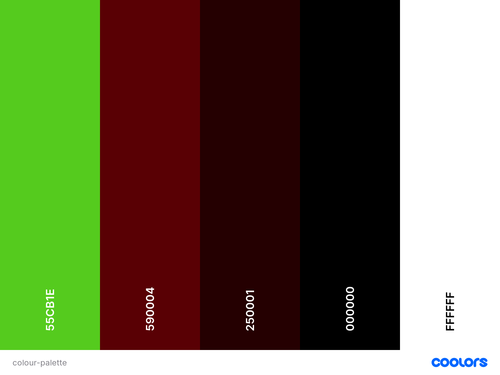
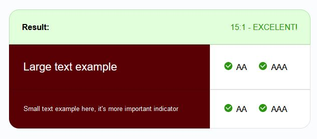
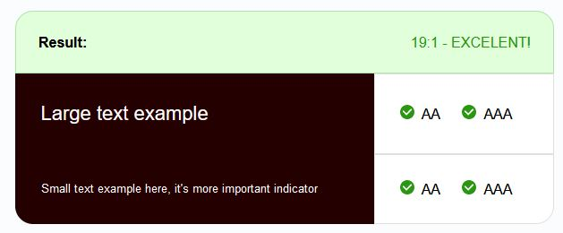
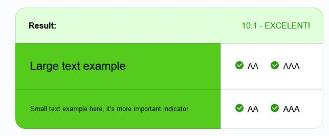
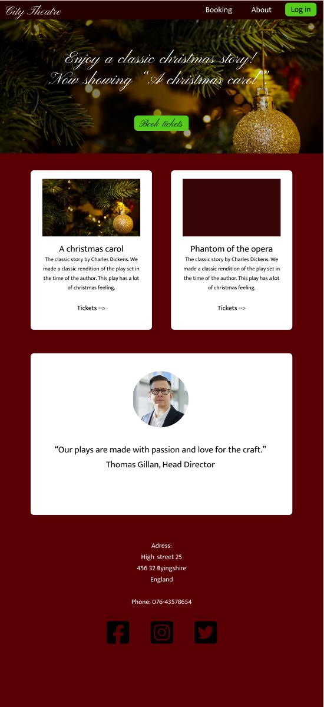
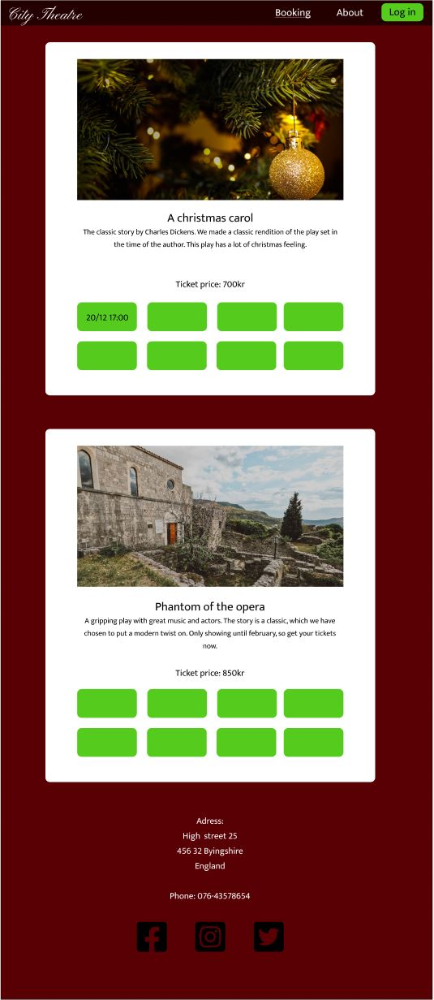
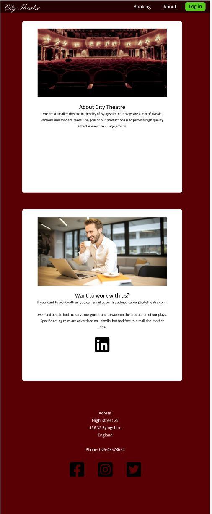
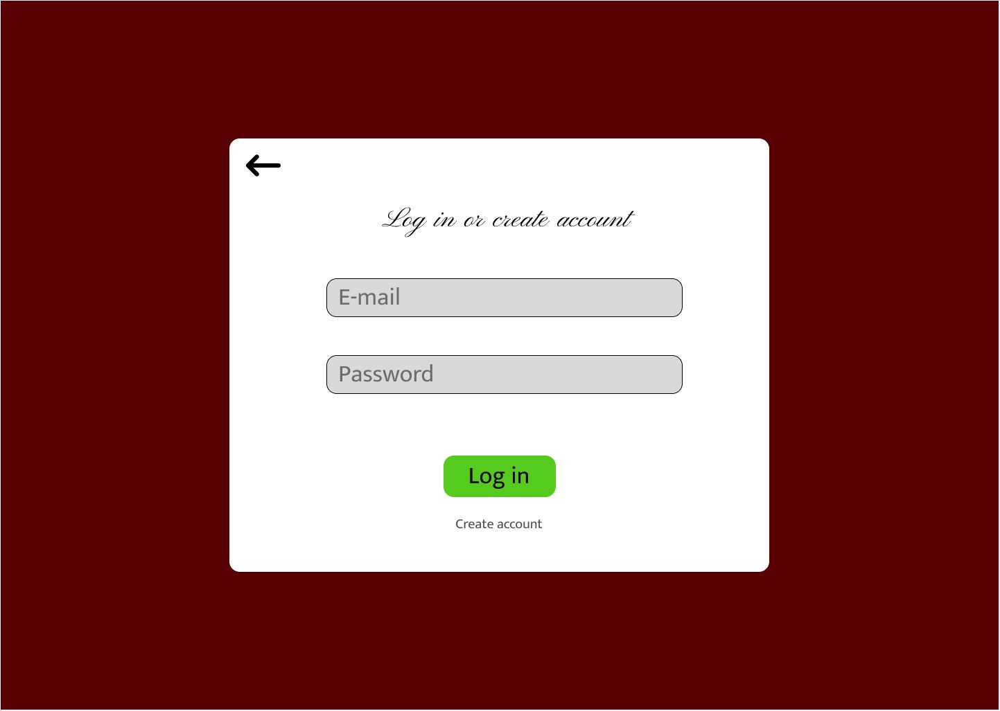
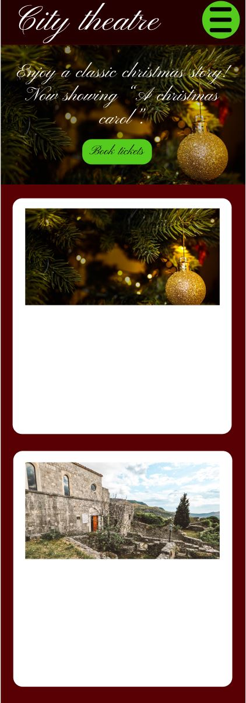

# Theatre booking website
A website for a made up theatre, with booking functions. This website was made as the fourth project of the Code Institute's diploma in software development.

## UX - User Experience
### User Stories
I want the costumer to be able to:
- See what dates the plays are.
- Make bookings, reebook and cancel bookings.
- See their booking information.

I want the admin to be able to:
- See the bookings made.
- Change and cancel bookings.

### Colour
I chose to use red bacause it is a common colour used in theatres. I have a lighter and a darker red for background and menues. Then i have a green for buttons, and black and white for the text. White is also used for the content fields.

All colours passed the [Accessibility Checker's](https://www.accessibilitychecker.org/color-contrast-checker/) colour contrast test.

### Structure and typography
I wanted the website to look classy and to remind people of a theatre (tried to do that with the background colour).
#### Structure
These are the innitial wireframes.

#### Typography
All fonts are san serif due to it being easier to read on a screen. The fonts i chose were

## Features
### Starting page

### Potential features

## Testing

### User stories

### Device testing

### Browser testing

### Peer review

### Validator testing

### Software testing

#### JavaScript testing - Jest

#### Python testing

### Bugs
#### Fixed bugs

#### Unfixed bugs

### Deployment

## Credits

### Code

### Content and media
