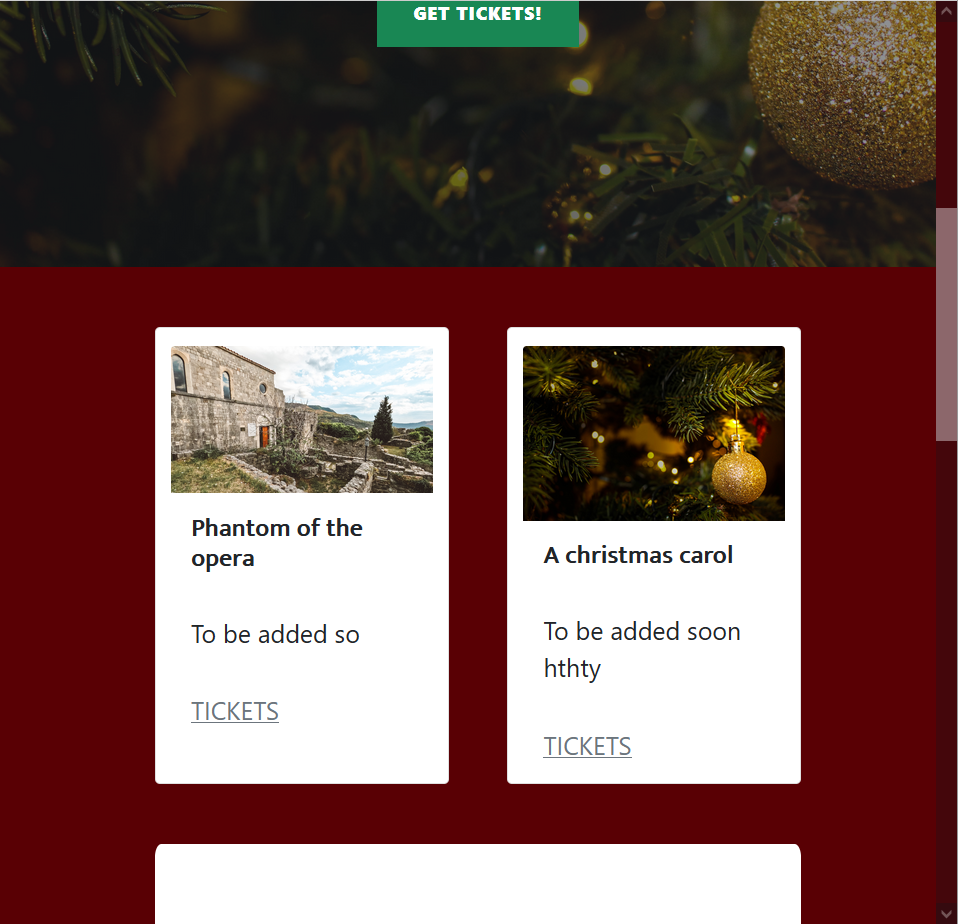
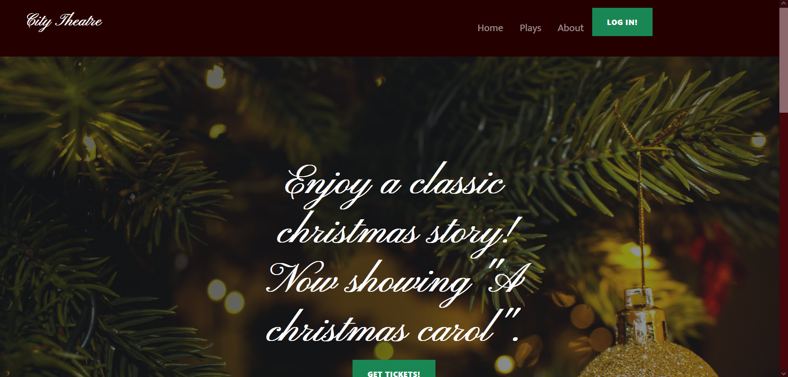

# Theatre booking website
A website for a made up theatre, with booking functions. This website was made as the fourth project of the Code Institute's diploma in software development.

## UX - User Experience
### User Stories
I want the costumer to be able to:
- See what dates the plays are.
- Make bookings.
- See their booking information.

I want the admin to be able to:
- See the bookings made.
- Change and cancel bookings.

### Colour
I chose to use red bacause it is a common colour used in theatres. I have a lighter and a darker red for background and menues. Then i have a green for buttons, which I ended up not using. Lastly, there were black and white for the text. White is also used as background for the content fields.

All colours passed the [Accessibility Checker's](https://www.accessibilitychecker.org/color-contrast-checker/) colour contrast test.

### Structure and typography
I wanted the website to look classy and to remind people of a theatre (tried to do that with the background colour). Then i chose to use white cards for the content in order to make them stand out.
#### Structure
These are the innitial wireframes. The final product deviates a bit from these.

#### Typography
All fonts are san serif due to it being easier to read on a screen. The fonts i chose were [Mukta](https://fonts.google.com/specimen/Mukta?query=mukta) for the content, and [Pinyon Script](https://fonts.google.com/specimen/Pinyon+Script?query=pinyon+) for "city theatre" at the top. It is also used for some of the text on the log in page and the promotional image.

I used the Pinyon Script font due to cursive font making it look classy, which goes well with the rest of the page. For the content I needed something that was easy to read, but still fit into the classy look. That is why i chose Mukta.

## Features
### Navigation and footer
The navigation bar changes between being a hamburger menue and a standard navigation bar depending on the screen size. It has links to all pages and a button that sends you to the login page.

In the footer you can find the adress of the theatre and links to all relevant social media.

### Home page
The starting page has a big image trying to make the user buy tickets for a play (a green button takes the user to the page for choosing a play). Below that all plays are shown (click "TICKETS" to see dates available). Last of all there is a quote from the director. 

### Plays page
Shows all the plays. This is where you choose what play you want to watch. When you click on "TICKETS", you will be sent to a page where you can choose what date and time you want to see the play.

### Dates page
This is where you choose what date and time you want to watch the lay. The page only shows the times available for the chosen play. If you click on one of the times, you will be sent to the booking form page, where you can add contact information and specify how many tickets you want to reserv.

The database is used to keep track of dates and which times plays have seats left. The ones that have seats left are shown in green, while the other ones are shown in grey. The grey ones does not take you anywhere.

### Login/log out page
I used django allauth for the accounts. The login, and log out pages are the allauth template with the css used for the rest of the site.

### User page
It is used to show the user their booking information. The database is used to keep track of the booking information.

All bookings are shown in a simple table.

### About page
The about page is a simple page with info about the theatre and potential job openings. It contains 2 cards.

### Admin functionality
A page on the frontend shows the admin what bookings are placed ("bookings" in nav-bar. Only visible to superuser). On another page the admin can add plays (link in nav-bar if logged in as superuser). On the date booking page the admin can edit and delete plays. These buttns only shows up if you are logged in as a superuser (admin). No admin page is available if you are not a superuser.

Everything else has to be done from the Django admin page (found at /admin).

### Potential features
- A function that sends an email to the user containing all booking information. 
- More robust admin functionality.

## Testing
This project was tested maually.

### User stories
I want the costumer to be able to:
- See what dates the plays are.
 - Can be fount on the dates-booking page.
- Make bookings.
 - Bookings can be made by users regardless of login status.
- See their booking information.
 - All bookings connected to a users account can be found on the profile page.

I want the admin to be able to:
- See the bookings made.
 - The admin can see the bookings thru the bookings page (admin only).
- Change and cancel bookings.
 - It is also possible to change or cancel bookings on the admin page.
  - Can be done, but only thru the Django admin page. The plays can be changed or deleted from the frontend.

### Device testing
Since I used a premade template, most of the device size adaption were already made. All i had to do was make sure the content was the right size. I still checked on multiple devices to make sure everything was working.

I tested the website (natively) on these devices:
- iPhone SE (2nd generation)
- iPad
- Desktop computer (1440p)
- Laptop (ACER aspire 5)

I also tested the website on Mozilla developer tools:

### Browser testing
The website was tested on these browsers:
- Mozilla Firefox
- Google Crome
- Microsoft Edge
- Safari
- DuckDuckGo (mobile)

### Peer review

### Validator testing

### Software testing

#### JavaScript testing - Jest

#### Python testing

### Bugs
#### Fixed bugs
- I had a bug where the site would not deploy to heroku. I managed to fix this by looking at the error messages and solving them one by one. To do this I used help from my fellow students (via slack), stackoverflow and Code Institute's tutors. 
- Another bug that took a long time to fix was the fact that i could not get the links to the images to work. it turnd out it was a few things that had to be changed in the settings for the media-url. It took a while to figure out the correct lines of code, but with the help of the Code Institute tutors the bug was finally solved.

#### Unfixed bugs

### Deployment
This project was deployed with Heroku, and used Whitenoice for its static files.

- Create an account at Heroku, and do not forget you need to confirm your e-mail to do this.
- Create a list of dependencies in a text file named requirements (pip3 freeze > requirements.txt).
- Create an app by clicking the "create a new app" button found on the dashboard.
    - Choose a unique app name.
    - Choose your region and click "create app"
- Click on settings (for the app).
    - Find the Config Vars section and add potential files that you cannot upload to github. For example API credentials. KEY is the title, and VALUE is the content. For thos project you need to add the Django key and the database-url.
    - Add buildpacks (below Config Vars). For this project, I installed Python and Node.js. Make sure they are in the correct order.
- Go to the deploy section.
    - Choose to deploy from GitHub.
    - Connect your account and choose a repository to deploy from.
    - Choose either Automatic or Manual deployment (recommended).
- Follow the steps on [this page](https://whitenoise.evans.io/en/stable/django.html) to set up Whitenoice.
- Make sure your images are on an external site, like [ibb](https://ibb.co). This prevents errors related to the images.
- Make sure the live site is working.

## Credits

### Code
The Backend part of the code is based on Code Institute's "I think therefore I blog" walkthru project. Some small parts are also based on the [Boutique Ado]() project from Code Institute. The front end part is made using a modified version of the [Clean blog](https://startbootstrap.com/theme/clean-blog) template from [startbootstrap](startbootstrap.com).

### Content and media
The pictures for this project is from [pexels.com](www.pexels.com). The [christmas picture](https://www.pexels.com/photo/gold-christmas-bauble-246351/) is from the user Valeria Vinnik, the [house picture](https://www.pexels.com/photo/stone-building-on-a-countryside-5667618/) is from the user ROMAN ODINTSOV, the [theatre picture](https://www.pexels.com/photo/theater-interior-109669/) is from the user Donald Tong, the [jobs picture](https://www.pexels.com/photo/depth-of-field-photo-of-man-sitting-on-chair-while-holding-cup-in-front-of-table-927451/) is from the user Andrea Piacquadio, and the [head director picture](https://www.pexels.com/photo/man-wearing-white-dress-shirt-and-black-blazer-2182970/) is from the user LinkedIn Sales Navigator.

All icons are from [font awesome](https://fontawesome.com/icons), and the fonts are from [Google fonts](https://fonts.google.com/).

Erik Vodopivec Forsman, 2023
